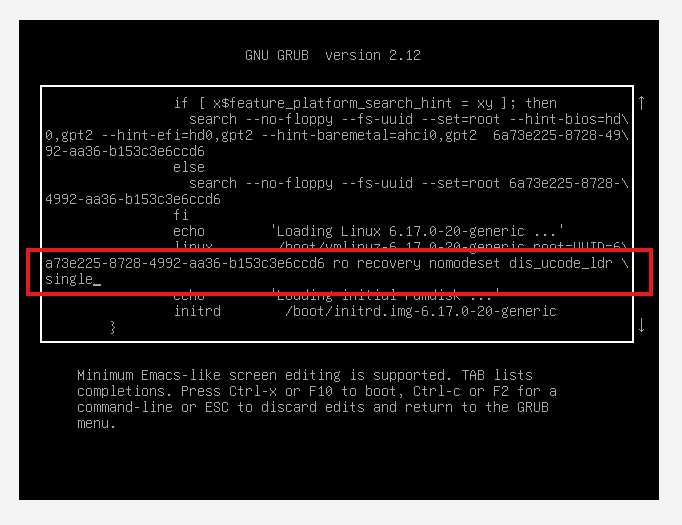
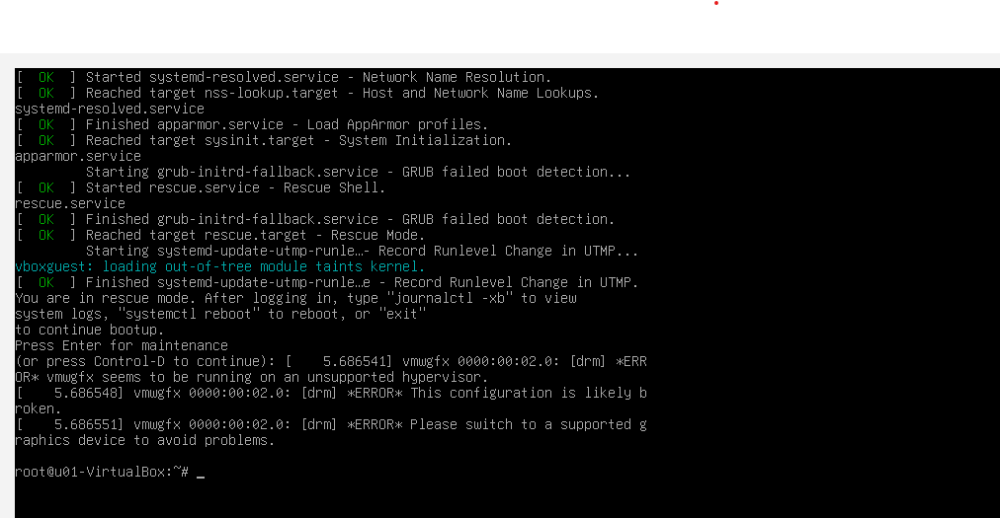
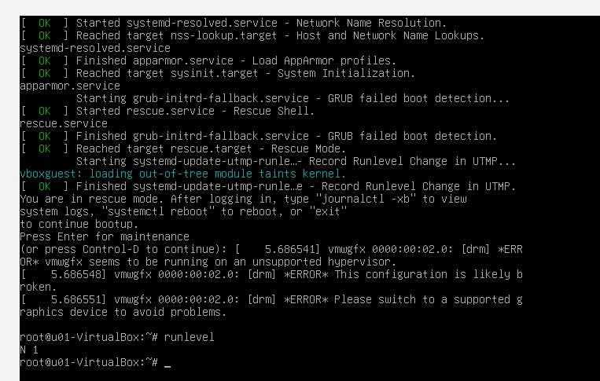

# Exercise 5.1 – Using Rescue Mode (Single-User Mode)

## Objective

Understand how to boot a Linux system into **single-user mode** (rescue mode) in order to:

- Troubleshoot system issues
- Repair filesystems
- Modify configurations without performing a full system startup

---

## What is Single-User Mode?

Single-user mode is a **minimal Linux boot environment** where:

- Only essential system services are started
- You are logged in as the **root user**
- Multi-user and network services are typically disabled

### Common Use Cases

- Reset forgotten passwords
- Repair broken configuration files
- Check or repair filesystems
- Troubleshoot boot failures

---

# Step 1 – Check Current Runlevel

Before entering rescue mode, verify your current runlevel.

```bash
runlevel
```

## Example Output

```bash
N 5
```

<p align="center">
  
</p>

## Interpretation

|Value|Meaning|
|---|---|
|N|No previous runlevel (fresh boot)|
|5|Graphical multi-user mode|

> On some systems, you may see `3` instead of `5`.

## Step 2 - Access the GRUB Boot Menu

Reboot the system:
```bash
reboot
```

During startup:
- Press any arrow key to stop the GRUB countdown timer
- On Ubuntu systems where GRUB is hidden, hold **Shift**

<p align="center">
  
</p>

# Step 3 - Edit the Boot Entry

1. Highlight the default boot entry
2. Press: `e`
> This opens the GRUB editor
3. Scroll down until you find the line beginning with:
> linux /boot/vmlinuz-...

<p align="center">
  
</p>

# Step 4 - Enter Single-User Mode

At the end of the `linux` line, append:
> single

## Example
> linux /boot/vmlinuz-... ro quiet splash single

Then boot using:
> Ctrl + X

Some systems also accept `F10`.

# Step 5 - Enter Root Environment

Depending on the Linux distribution:
- Enter the **root password**
- Or press `Ctrl + D`

You should arrive at a root shell:
```bash
root@hostname:~#
```

<p align="center">
  
</p>

# Step 6 - Verify Rescue Runlevel

Run:
```bash
runlevel
```

## Expected Output
> N 1

<p align="center">
  
</p>

# What you can do in Rescue Mode

## Edit Configuration Files
```bash
nano /etc/fstab
```

## Reset User Passwords
```bash
passwd username
```

## Check Filesystems
```bash
fsck /dev/sda1
```

## Investigate Boot Problems

- Broken mounts
- Invalid configs
- Service startup failures

# Step 7 - Reboot Back to Normal Mode

When finished:
```bash
reboot
```
 The system will boot normally.

 # Step 8 - Confirm Normal Runlevel

 After logging in:
 ```bash
 runlevel
 ```

 ## Example Output
 > N 5
 or 
 > N 3

 # Important Notes
 - GRUB edits made during boot are temporary
 - Single-user mode may bypass normal login protections
 - Network access is usually disabled
 - Some modern systems use `systemd rescue.target`
 
 # Key Takeaways
 - Single-user mode is a powerful recovery tool
 - It provides root-level maintenance access
 - Commonly used for troubleshooting and repairs
 - Essential skill for Linux administrators
 ---