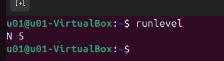
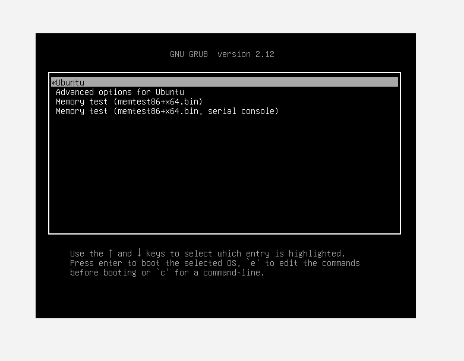

# Exercise 5.1 - Using Rescue Mode (Single-User Mode)
## Objective
Understand how to boot a Linux system into single-user (rescue) mode to:
- Troubleshoot system issues
- Repair filesystems
- Modify configurations without full system startup
## What is Single-User mode?
- Single-user mode is a minimal boot environment where:
    - Only essential services are started
    - You are logged in as the **root user**
    - No multi-user or network services are running
- Common use cases:
    - Reset forgotten passwords
    - Fix corrupted filesystems
    - Repair broken configurations
## Step 1 - Check Current Runlevel
Before entering rescue mode, verify your current system state:
```bash
runlevel
```
### Example Output
> N 5

<p align="center">
  
</p>


### Interpretation
|Value|Meaning|
|---|---|
|N|No previous runlevel (fresh boot)|
|5|Current runlevel (graphical mode)|

## Step 2 - Access GRUB Menu
1. Reboot the system:
```bash
reboot
```
2. During boot:
    - Press any arrow key to stop countdown
    - If menu is hidden (e.g., Ubuntu), hold shift

<p align="center">
  
</p>

## Step 3 - Edit Boot Entry
1. Select the default kernel (usually first option)
2. Press:
> E
3. Locate this line:
> linux /boot/vmlinuz-... root=... ro quiet splashlinux /boot/vmlinuz-... root=... ro quiet splashlinux /boot/vmlinuz-... root=... ro quiet splashlinux /boot/vmlinuz-... root=... ro quiet splash
## Step 4 - Enter Single-User Mode
At the end of the `linux` line, append:
> single
### Example:
> linux /boot/vmlinuz-... root=... ro quiet splash single
4. Boot using:
> Ctrl + X
## Step 5 - Enter Root Environment
Depending on distribution:
- Enter **root password**, or
- Pres `Ctrl + D` (if prompted)
You will now see:
```bash
root@hostname:~#
```
## Step 6 - Verify Runlevel
```bash
runlevel
```
### Expected Output
> N 1
- Runlevel 1 = Single-user mode
## What You Can Do Here
- Edit system files:
- Reset passwords:
- Check filesystems:
- Fix boot/config issues
## Step 7 - Reboot back to Normal Mode
```bash
reboot
```
System will boot normally.
## Step 8 - Confirm Normal Runlevel
After login:
```bash
runlevel
```
### Expected Output
> N 5 # or 3 depending on system
## Important Notes
- Changes made in GRUB edit mode are **temporary**
- Single-user mode may **bypass security controls**
- Some systems require **root password for access**
- Network services are usually **disabled**
## Key Takeaways
- Single-user mode = **safe troubleshooting environment**
- Accessed via GRUB boot parameter modification
- Useful for recovery, repair, and admin tasks
- Always reboot to return to normal operation
---